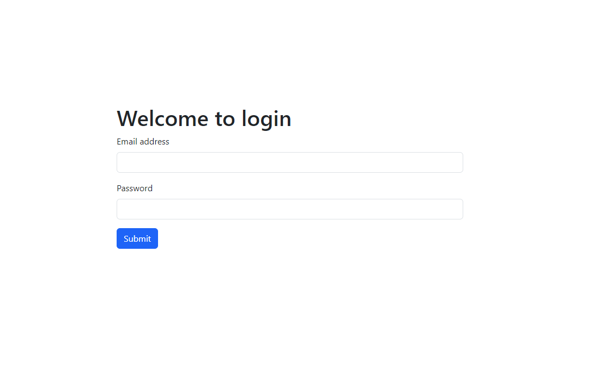
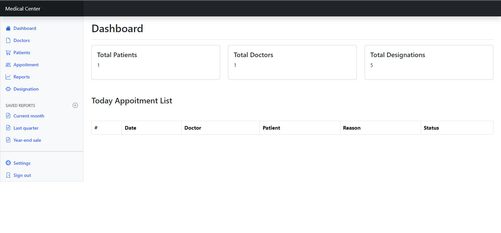
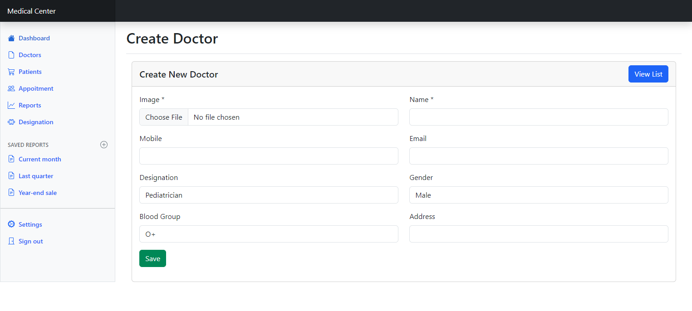

# Laravel simple medical report

## Installation

1. Dependencies install :

    ```bash
    git clone https://github.com/alaminstackamin/laravel-medical-reports.git
    cd ./laravel-medical-reports


    composer install


2. Database setup

    - Create an empty database on phpmyadmin
    - Copy content of `.env.example` into new `.env` file
        ```bash
        cp .env.example .env
        ```
    - Change those values on the `.env` file
        ```env
        DB_CONNECTION=mysql
        DB_HOST=127.0.0.1
        DB_PORT=3306
        DB_DATABASE=database
        DB_USERNAME=root
        DB_PASSWORD=
        ```
    - Migrate the database
        ```bash
        php artisan migrate
        ```
    - [Optional]: Seed the database
        ```bash
        php artisan db:seed
        ```
        > check `database/seeders/DatabaseSeeder.php` for details.

</br></br> 3. Login to the app:

-   if you checked `DatabaseSeeder.php` as I told you (look above) you will notice that 4 users has been created :

| role      | email                       | password |
| --------- | --------------------------- | -------- |
| Admin     | admin@gmail.com     | admin***   |


This template provides a minimal setup to get laravel, New application

# Theme content design for login page



# Theme content design for home page




# Theme content design for doctor list and create page





# Theme content design for patient list and create page


# Theme content design for designation list and create page


